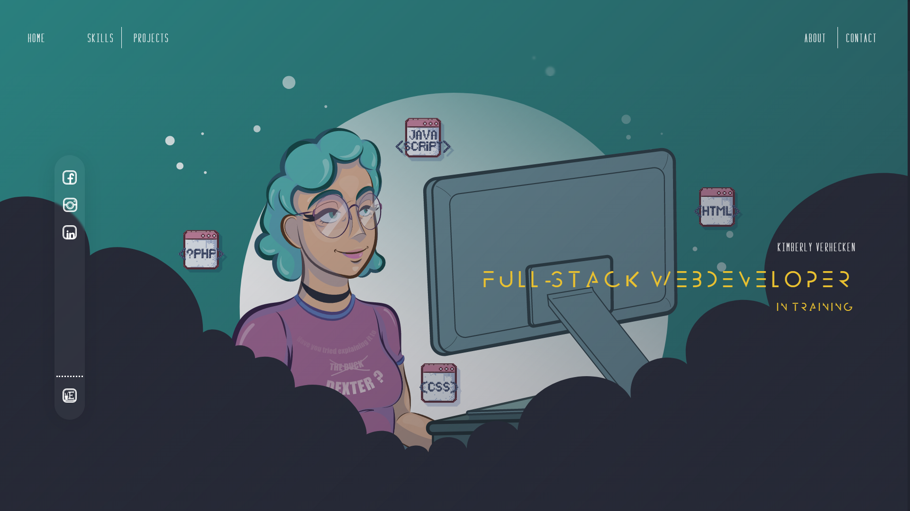
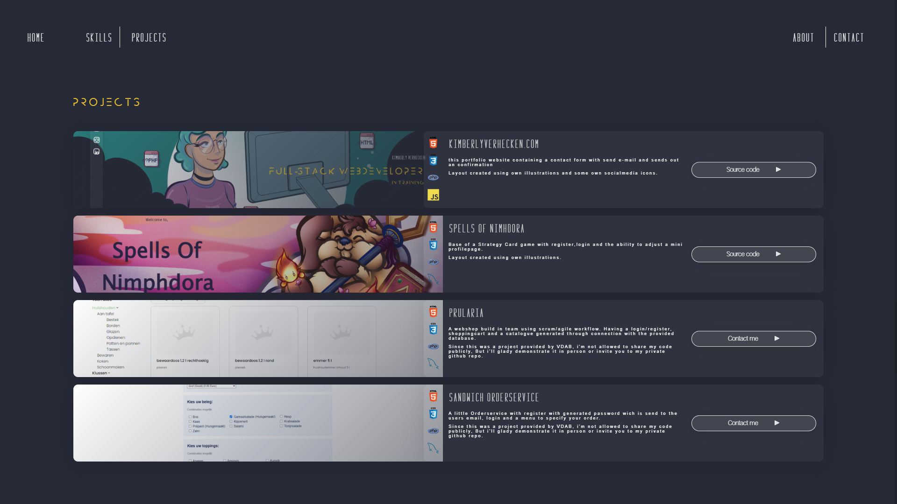
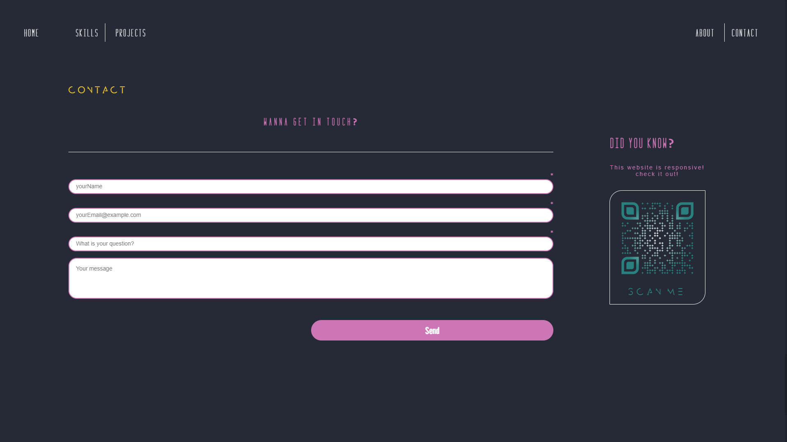

<h1 align="center" id="title">KimberlyVerhecken.com</h1>

My little portfolio site with responsive layout. Layout created using own illustrations made in Adobe Illustrator.

<h2>🧐 Features</h2>

Here're some of the project's best features:

*   Scroll to navigation
*   Hamburgermenu on mobile
*   Project display blocks
*   Contactform
*   Sends confirmation E-mail
*   Call-me-button only seen on mobile devices
*   QR-code only seen on desktops

<h2>🚀 Demo</h2>

[https://kimberlyverhecken.com/](https://kimberlyverhecken.com/)

<h2>💻 Built with</h2>

Technologies used in the project:

*   PHP
*   HTML5
*   CSS3
*   JS

<h2>Project Screenshots:</h2>

